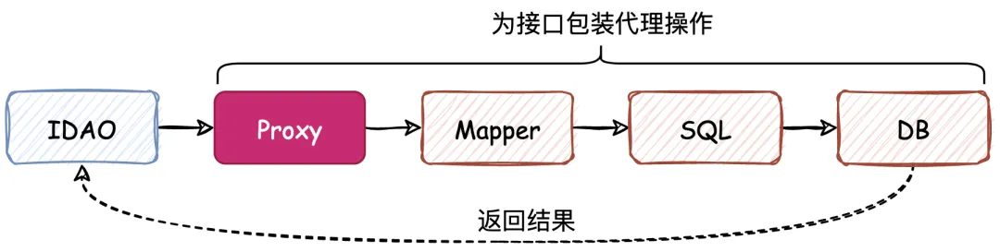
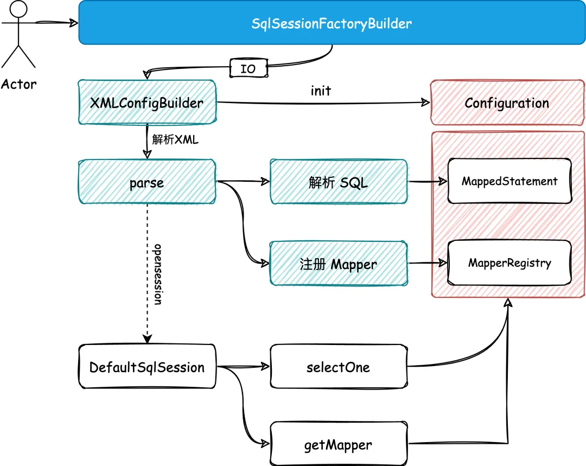

## 手写Mybatis--chapter3

### 实现功能

1. 解析mapper的XML文件，生成对应的SQL语句

### 流程介绍

1. SqlSessionFactoryBuilder读取对应路径的mapperXML文件
2. 使用XMLConfigBuilder来init一个Configuration对象
3. 使用XMLConfigBuilder解析SQL，并将结果存储到MappedStatement对象中

### 工程结构
```
mybatis-step-03
└── src
    ├── main
    │   └── java
    │       └── cn.bugstack.mybatis
    │           ├── binding
    │           │   ├── MapperMethod.java
    │           │   ├── MapperProxy.java
    │           │   ├── MapperProxyFactory.java
    │           │   └── MapperRegistry.java
    │           ├── builder
    │           │   ├── xml
    │           │   │   └── XMLConfigBuilder.java
    │           │   └── BaseBuilder.java
    │           ├── io
    │           │   └── Resources.java
    │           ├── mapping
    │           │   ├── MappedStatement.java
    │           │   └── SqlCommandType.java
    │           └── session
    │               ├── defaults
    │               │   ├── DefaultSqlSession.java
    │               │   └── DefaultSqlSessionFactory.java
    │               ├── Configuration.java
    │               ├── SqlSession.java
    │               ├── SqlSessionFactory.java
    │               └── SqlSessionFactoryBuilder.java
    └── test
        ├── java
        │   └── cn.bugstack.mybatis.test.dao
        │       ├── dao
        │       │   └── IUserDao.java
        │       ├── po
        │       │   └── User.java
        │       └── ApiTest.java
        └── resources
            ├── mapper
            │   └──User_Mapper.xml
            └── mybatis-config-datasource.xml
```